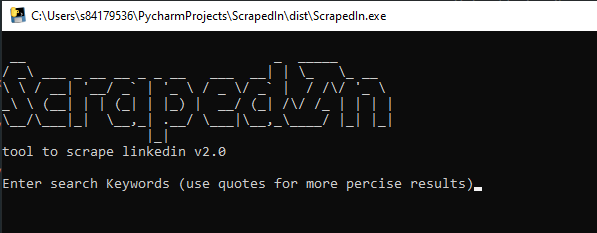
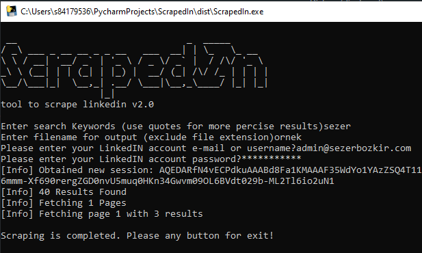
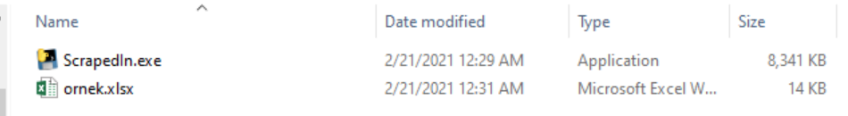
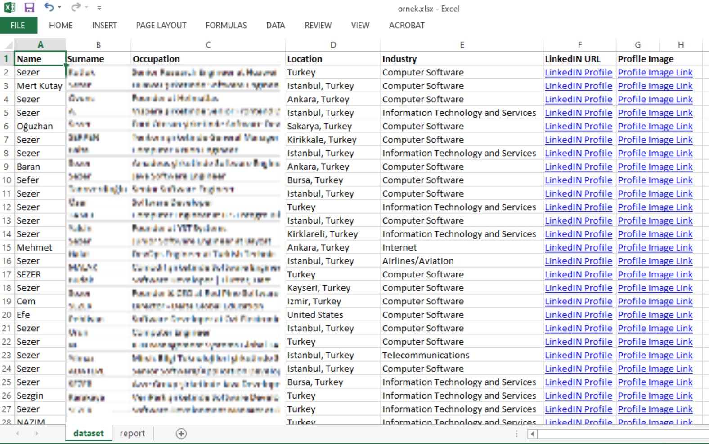

# ScrapedIn
tool to scrape LinkedIn

this tool assists in performing reconnaissance using the LinkedIn.com website/API. Provide a search string just as you would on the original website and let ScrapedIn do all the dirty work. Output is stored as an XLSX file, however it is intended to be used with Google Spreadsheets. After importing the XLSX into Google Spreadsheets there will be a "dataset" worksheet and a "report" worksheet.

## dataset
- first name
- last name
- occupation
- location
- industry
- profile URL
- picture URL

## report
- Picture (displayed)
- Full Name, Occupation
- Link to Profile

### Disclaimer
this tool is for educational purposes only and violates LinkedIn.com's TOS. Use at your own risk.

## Screenshots









## How to install
`sudo apt-get install python-pip -y`

`sudo pip install -r requirements.txt`

## How to build
```shell
pyinstaller --onefile ScrapedIn.py
```
